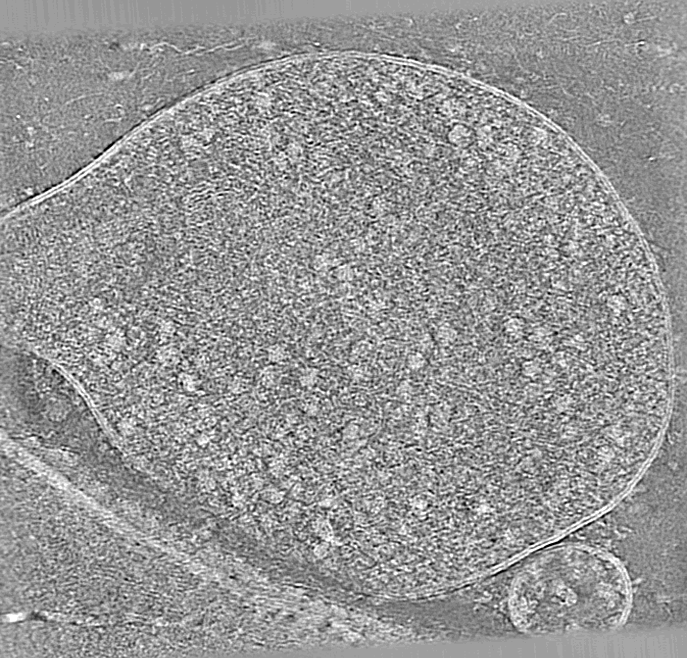

# miss-alignment

[](https://github.com/warpem/miss-alignment/raw/main/LICENSE)
[](https://pypi.org/project/miss-alignment)
[](https://python.org)
[](https://github.com/warpem/miss-alignment/actions/workflows/ci.yml)



Better alignment = cleaner tomograms. GIF shows a denoised reconstruction after patch tracking alignment and miss-alignment.

## Installation

Installation is limited at the moment to a specific python, CUDA, and torch version. This might be fixed at some point in the future. For now, its easiest to set everything up in a conda environment.

First create an environment called `miss-alignment` with cuda-toolkit 12.9 and activate it:

```
conda create -n miss-alignment -c conda-forge python=3.11 cuda-toolkit=12.9 -y
conda activate miss-alignment
```

We need to fix some GPU dependencies for accelerated reconstruction:
```
python -m pip install torch==2.8.0
python -m pip install torch-projectors --index-url https://warpem.github.io/torch-projectors/cu129/simple/
```

> [!IMPORTANT]
> If your GPU's have the Blackwell-architecture make sure to install at least v0.11 of [torch-projectors](https://github.com/warpem/torch-projectors).

Finally install miss-alignment with this command:

```
python -m pip install miss-alignment
```

Check that the CLI shows up with:

```
miss-alignment --help
```

This lists the available commands (`train` and `infer`); run
`miss-alignment train --help` or `miss-alignment infer --help` for details on
each.

## How to run?

See [docs/usage.md](docs/usage.md) for instructions.

## Changelog

A full list of changes per release is available on the [GitHub Releases page](https://github.com/warpem/miss-alignment/releases).

## Citation

Chaillet, M.L., van Loenhout, J., Leung, M.R., Burt, A., and Tegunov, D. (2026) *MissAlignment Teaches Itself Better Cryo-ET Tilt-Series Alignment by Making It Worse*. bioRxiv. https://doi.org/10.64898/2026.04.29.721716
